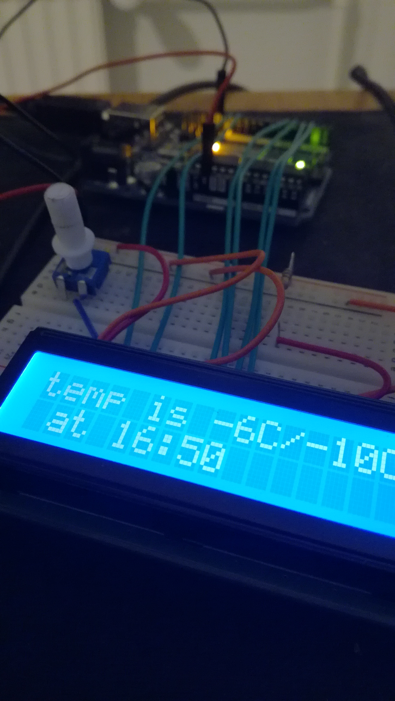

#### Arduino LCD - Python
##### Requirements
* Python 3.6+
* Arduino [IDE](https://www.arduino.cc/en/Main/Software)

How to [setup](https://www.arduino.cc/en/Tutorial/LiquidCrystalSerialDisplay)


```
$ git clone https://github.com/nicolaskyejo/arduino_lcd.git
$ cd arduino_lcd
```
* Upload sketch using Arduino IDE, check serial port
and edit ['weather.py'](https://github.com/nicolaskyejo/arduino_lcd/blob/577705ea709825f2b1517a66c8e5f252e233c762/weather.py#L7)
accordingly
* If you don't have pipenv, install it (for example ``python -m pip install pipenv``)
```
$ pipenv install
$ pipenv shell
$ python weather.py
```


